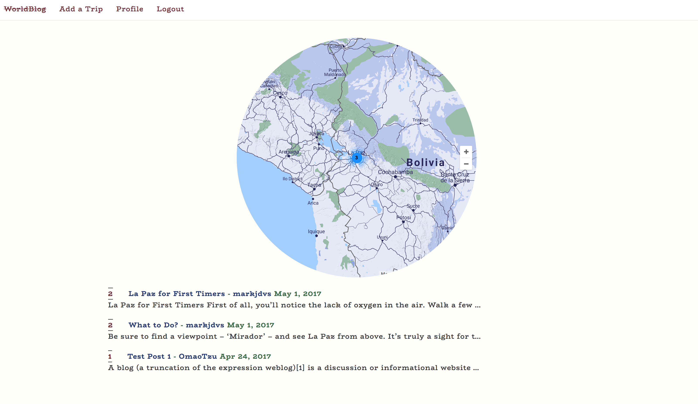
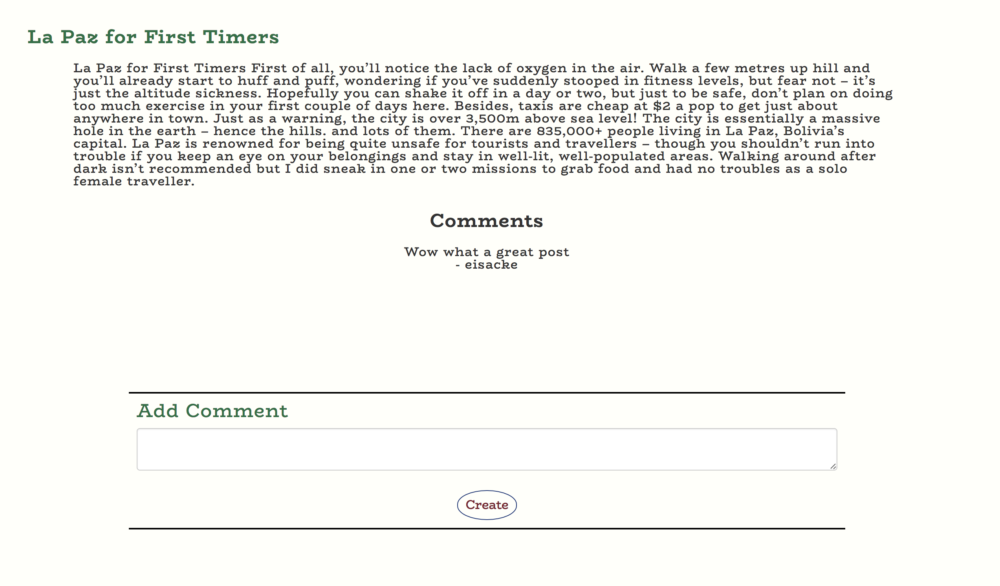

# Project 4
Omar Harvey-Phillips
Mark Davis

## MyGuideBlog

GA WDI London - Project 4 (Group Project)

For the fourth project we were tasked with creating a Ruby on Rails back end with an Angular front end app and for this project we could choose whether to work in teams or not. We worked in a group of two.

After doing a UK property based app for our third project we decided for our final one to do something focused on abroad. We settled on a Travel Blogging Platform that aimed to have heavy user input and a rating system whilst also incorporating elements of a journey planner.
[See it here!](https://secure-plateau-23163.herokuapp.com/)

### Approach / How it works

The aim of the app was to create a system whereby as people travelled they could upload information about their travel and rate each location according to specif sets of values

These blog posts would then be map onto an index page contain one global map and display all the blog posts from specific locations when click on.

We implemented an upvoting system so those with number of votes would be higher up the index of blog posts for that location.

Alongside this users have the ability to upload photos and comments to each specific post

I focused on map functionality, user authentication, integration with Amazon Web Services and on the back end model relationships.
##Technologies used

JavaScript, SCSS, HTML, Ruby, Ruby on Rails, AngularJS, PostgreSQL, AJAX, AWS, Moment.js, Google Maps API, Skyscanner API, Bootstrap, Gulp

Colour coordination was established by using Coolers and the landing page image was taken from Unsplashed.

The Google Web Font 'BioRhyme' was used to style the site.

